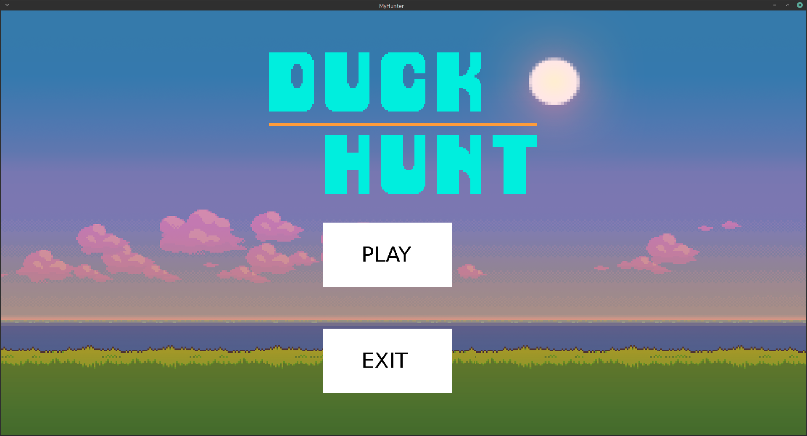
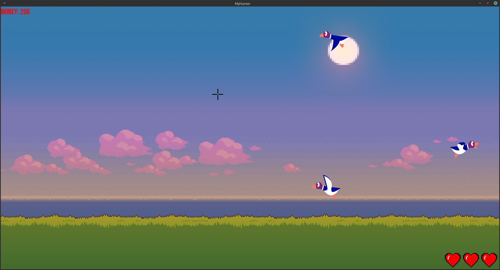

# My_Hunter

## Project Description
Epitech 1st year Project where the goal was to make the famous Duck Hunt game in C with the graphical library CSFML.

## Project Screenshots
Here are some of the ingame screenshots.

## Compilation
To be able to compile, you must install the CSFML library.
Then, you have to run the `make` command.
To uninstall the game, run `make fclean`.
